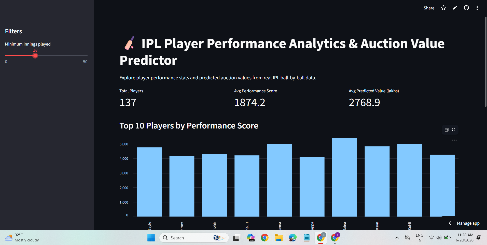
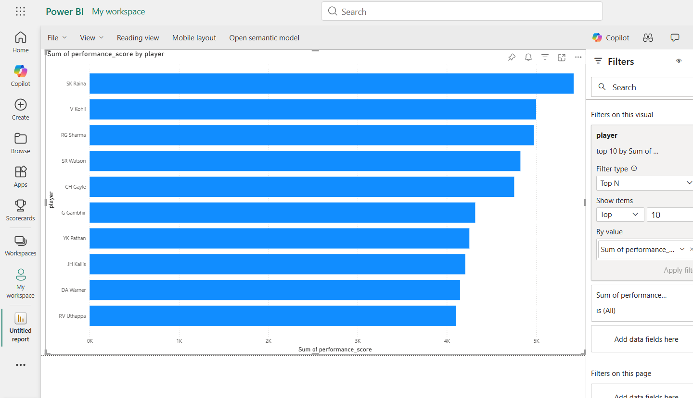
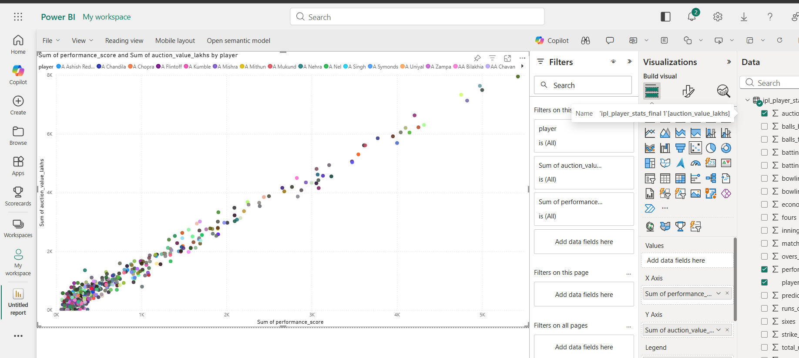

# 🏏 IPL Player Performance Analytics & Auction Value Predictor

An end-to-end data science project that turns raw IPL ball-by-ball data into player performance insights, a predictive valuation model, and an interactive live dashboard.

**🔗 Live App:** [ipl-player-analytics-bhhaavo2ibj6kwramplxmw.streamlit.app](https://ipl-player-analytics-bhhaavo2ibj6kwramplxmw.streamlit.app/)

---

## 📌 Overview

This project analyzes 136,000+ real ball-by-ball records from IPL matches to:
- Engineer 14 batting and bowling performance features per player
- Build a performance-weighted player valuation score
- Train a Random Forest regression model to predict that valuation (94.5% R²)
- Identify undervalued players using a performance-to-value ratio
- Present findings through an interactive Power BI dashboard and a deployed Streamlit web app

---

## 🛠️ Tech Stack

| Category | Tools |
|---|---|
| Data Processing | Python, Pandas, NumPy |
| Machine Learning | Scikit-learn (Random Forest Regressor) |
| Visualization | Power BI, Streamlit |
| Data Source | Real IPL ball-by-ball match data (2008–2017) |

---

## 📊 Project Pipeline

1. **Data Loading** — Loaded 136,598 rows of ball-by-ball IPL data
2. **Cleaning** — Handled missing dismissal data with meaningful labels
3. **Feature Engineering** — Built batting stats (runs, strike rate, average, boundaries) and bowling stats (wickets, economy, bowling average) for 469 players
4. **Target Construction** — Created a domain-weighted performance score and simulated valuation, since real auction price data requires a separate proprietary dataset
5. **Modeling** — Trained a Random Forest Regressor (80/20 train-test split), achieving **94.5% R²**
6. **Insight Generation** — Ranked players by performance-to-predicted-value ratio to surface undervalued talent
7. **Dashboarding** — Built a 3-page Power BI report (Top performers, Performance vs. Value scatter, Undervalued players table)
8. **Deployment** — Shipped a live Streamlit app with filtering and player comparison tools

### Power BI Dashboard

**Top 10 Players by Performance Score**

**Performance Score vs. Predicted Auction Value**

---

## 📁 Repository Structure
